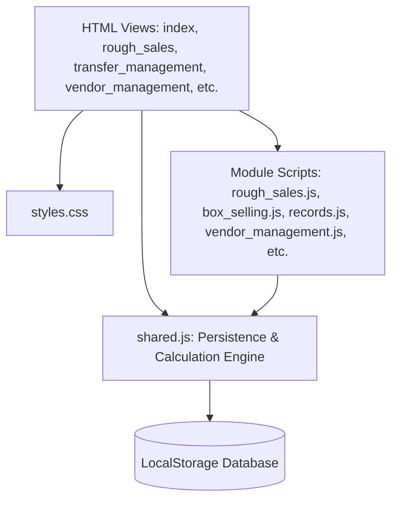

# RV Gems ERP — Complete Project & Architecture Documentation

Welcome to the comprehensive technical and operational documentation for the **RV Gems ERP** system. This system is a custom-designed, client-side Enterprise Resource Planning (ERP) application engineered specifically for diamond traders, manufacturers, and brokers. It manages rough diamond acquisitions, processing/conversions, box assembly (Dabbi making), stock transfers, vendor consignments, sales distribution, and ledger accounting.

---

## Table of Contents
1. [System Overview & Design Philosophy](#1-system-overview--design-philosophy)
2. [Technical Architecture & File Structure](#2-technical-architecture--file-structure)
3. [LocalStorage Schemas & Data Structures](#3-localstorage-schemas--data-structures)
4. [Functional Modules Specification (Super-Modules Layout)](#4-functional-modules-specification-super-modules-layout)
5. [The Accounting Split & Calculation Engine](#5-the-accounting-split--calculation-engine)
6. [Multi-Location Inventory Flow & Stock Rules](#6-multi-location-inventory-flow--stock-rules)
7. [Unified Records Viewer & Navigation Actions](#7-unified-records-viewer--navigation-actions)
8. [Ledger, Payments & Deadline Tracking](#8-ledger-payments--deadline-tracking)
9. [Dashboard & Payment Action Center](#9-dashboard--payment-action-center)

---

## 1. System Overview & Design Philosophy

The RV Gems ERP is designed around an **information-dense, single-screen-focused, client-side architecture**. It operates without external server requirements, running entirely in modern web browsers using LocalStorage for database persistence.

### Key Philosophy Points:
- **Dense Data Representation**: Grid columns, text sizes, and tables are optimized for high-volume transactions.
- **Transactional Integrity**: All financial numbers are represented and rounded as **Integers** to prevent floating-point discrepancies, with the sole exception of weights (Carats), which carry a 3-decimal position.
- **Relational Integrity**: Modules are interlinked (e.g., Box Selling fetches details from Box Making, inventory stock is derived in real-time from active lists).
- **Multi-Location Division**: Operations are organized into two physical hubs: **Surat HQ** (acquisitions and factory production) and **Mumbai branch** (distribution, transfers, and vendor consignments).
- **Aesthetic Excellence**: Built using custom dark sidebars, color-coded status pills, and interactive grids with visual cues (like red rows for overdue payments).

---

## 2. Technical Architecture & File Structure

The project has a flat structure, separating concerns cleanly into HTML views, module JS scripts, shared calculation rules, and stylesheets.



### Core Files:
- **[shared.js](file:///e:/RV/shared.js)**: Holds the global list variables, LocalStorage getter/setter handlers, integer-rounding financial calculators, date formatters, and **dynamic stock allocation engines** (`getPolishStockDistribution` and `getDabbiStockDistribution`).
- **[styles.css](file:///e:/RV/styles.css)**: Centralized design system styling sheet. Customizes ERP buttons, KPI cards, badges, payment tables, inputs, sidebars (with super-module nesting), and printing templates.
- **[index.html](file:///e:/RV/index.html) / [dashboard.js](file:///e:/RV/dashboard.js)**: Dashboard panel showing overall financials, live stock location-wise summaries, recent activities timeline, and the Receivables/Payables boards.
- **[records.html](file:///e:/RV/records.html) / [records.js](file:///e:/RV/records.js)**: The unified record viewer. Houses an 8-tab navigation panel to view every transaction with detailed expandable drawer logs.
- **[ledger_details.html](file:///e:/RV/ledger_details.html) / [ledger_details.js](file:///e:/RV/ledger_details.js)**: Centralized invoice review and payment entry log sheets.

---

## 3. LocalStorage Schemas & Data Structures

Data is stored as serialized JSON arrays. Below are the structures of each document model:

### A. Buying/Selling Transaction Entry Schema
Used by `salesList` (`rv_gems_sales`), `buysList` (`rv_gems_buys`), `polishSalesList` (`rv_gems_polish_sales`), `polishBuysList` (`rv_gems_polish_buys`), and `boxSellingList` (`rv_gems_box_selling`).

```json
{
  "sellingNo": 1,          // Sequential primary key (buyingNo for buy transactions)
  "sellingDate": "2026-06-10", // Transaction Date (YYYY-MM-DD)
  "dalal": "Kishorbhai",   // Broker Name (vendor name if sold from consignment)
  "partyName": "Gems Export Corp", // Customer or Seller Party
  "currencyType": "Dollar", // "Rupees" or "Dollar"
  "totalDollar": 12500,    // Nullable (USD value)
  "dollarRate": 83.50,     // Nullable (exchange rate)
  "price": 1043750,        // Price per Carat (INR equivalent)
  "carat": 1.255,          // Diamond weight (Carats)
  "totalPrice": 1310000,   // Calculated gross total (carat * price)
  "discount": 1.5,         // Discount percentage (0-100%)
  "discountedAmount": 1290350, // gross - discountAmount
  "dalali": 1.0,           // Dalali percentage (0-100%)
  "dalaliAmount": 12904,   // Calculated broker commission
  "billPercentage": 40.0,  // Bill split percentage (0-100%)
  "billAmount": 516140,    // Bill portion of discountedAmount
  "cashAmount": 774210,    // Cash portion of discountedAmount
  "gst": 7742,             // Tax (0.25% or 1.5% of billAmount)
  "netBillAmount": 523882, // billAmount + gst
  "netCashAmount": 774210, // cashAmount
  "finalAmount": 1311000,  // netBillAmount + netCashAmount + dalaliAmount
  "deadlineDays": 30,      // Credit days allowed
  "deadlineDate": "2026-07-10", // Expected payment deadline
  "boxId": "F-374",        // Present ONLY in box_selling (referencing box making ID, comma-separated if batch)
  "items": [               // Present ONLY in batch box_selling
    { "boxId": "F-374", "carat": 0.60, "mPrice": 102500, "mValue": 61500 },
    { "boxId": "F-375", "carat": 0.55, "mPrice": 102500, "mValue": 56375 }
  ],
  "totalCarat": 1.15,      // Sum of carats for batch box selling
  "issueNo": "ISS-001",    // Prefilled if sold via vendor consignment
  "sourceLocation": "Vendor", // Prefilled if sold via vendor consignment
  "payments": [            // Array of payment history items
    {
      "id": "pay_178101489",
      "date": "2026-06-10",
      "type": "Bill",      // "Bill" or "Cash"
      "amount": 200000,
      "remarks": "Initial advance payment"
    }
  ]
}
```

### B. Transfer Record Schema
Key: `rv_gems_transfers`. Tracks stock movements between Surat and Mumbai.

```json
{
  "transferNo": "TR-001",
  "date": "2026-06-11",
  "itemType": "Polish",   // "Polish" or "Dabbi"
  "lotId": "PB-1",        // Present if Polish itemType
  "quantity": 20,         // Present if Polish itemType
  "boxIds": ["F-374", "F-375"], // Present if Dabbi itemType
  "fromLocation": "Surat",// "Surat" or "Mumbai"
  "toLocation": "Mumbai",  // "Surat" or "Mumbai"
  "remarks": "Repositioning stock",
  "createdAt": "2026-06-11T06:10:00.000Z"
}
```

### C. Vendor Master Schema
Key: `rv_gems_vendors`. Stores verified consignment brokers and partners.

```json
{
  "vendorId": "V001",
  "name": "Kishorbhai",
  "vendorType": "Dalal",  // "Dalal", "Party", "Broker", "Agent", "Trader", "Customer"
  "city": "Mumbai",
  "mobile": "9876543210",
  "createdAt": "2026-06-11T06:05:00.000Z"
}
```

### D. Vendor Consignment Issue Schema
Key: `rv_gems_issues`. Logs active inventory consignments.

```json
{
  "issueNo": "ISS-001",
  "date": "2026-06-11",
  "vendorId": "V001",
  "vendorName": "Kishorbhai",
  "items": [
    { "type": "Dabbi", "id": "F-374" },
    { "type": "Polish", "lotId": "PB-1", "quantity": 5 }
  ],
  "status": "Pending",    // "Pending", "Returned", "Sold"
  "resolvedDate": null,
  "createdAt": "2026-06-11T06:15:00.000Z"
}
```

---

## 4. Functional Modules Specification (Super-Modules Layout)

The ERP is organized into two primary Super-Modules based on geographical and functional operations, and one Global Portal for centralized visibility.

### Super-Module 1: 🏭 Surat HQ Operations
Focuses on diamond purchases, factory conversion, and initial sorting.
- **Surat Inventory** (`inventory.html`): Centralized view of Surat stock, history summaries, and real-time balances. Registered directly on the sidebar.
- **Rough Buys** (`rough_buy.html`): Log raw diamond lots. Adds to Surat Rough Stock. (0.25% GST, Dalali).
- **Rough Sales** (`rough_sales.html`): Sell raw diamonds. Deducts from Surat Rough Stock. (0.25% GST, No Dalali).
- **Conversions** (`conversions` sub-form): Records rough diamonds sent for factory processing, adding finished diamonds as `CONV-Y` lots in Surat.
- **Polish Buys** (`polish_buy.html`): Log incoming cut polish lots. Adds to Surat Polish Stock. (1.5% GST, No Dalali).
- **Box Making** (`box_making.html`): Assemble customized box batches (Dabbis). Deducts 2 Polish pieces from Surat stock (FIFO), creates 1 Dabbi box in Surat. Seeded with standard diamond entries (`I-1` through `I-60`).

### Super-Module 2: 🏢 Mumbai Operations
Focuses on distribution, inter-office transfers, vendor consignments, and sales matching.
- **Transfer Management** (`transfer_management.html`): Transfer Polish lots and Dabbi boxes between Surat and Mumbai. Features a smaller, compact Item Type selector and real-time searching (`filterDabbiList()`) on boxes.
- **Mumbai Inventory** (`mumbai_inventory.html`): Dedicated display of stock physically present in the Mumbai warehouse.
- **Vendor Management** (`vendor_management.html`): Register vendors, issue stock consignments from Mumbai, track days elapsed (aging), log returns, and redirect to sales forms for items sold.
- **Polish Sales** (`polish_sales.html`): Sales entry form for finished diamond lots. Prefillable from vendor consignments. Features a searchable checkbox list to select one or multiple Polish Lots from the selected branch, auto-populating pieces and carat weight. (1.5% GST, Dalali).
- **Box Selling** (`box_selling.html`): Sales entry form for Dabbi boxes. Supports multi-box (batch) selling via a searchable checkbox list, auto-aggregating carats and reference making value. Checkboxes are formatted to display only the Box ID and Carat weight. (1.5% GST, Dalali).

### 🗃️ Global Portal
Centralized management panels.
- **Global Inventory** (`inventory.html`): Real-time balance charts, history summaries, and lot listings company-wide.
- **Records Viewer** (`records.html`): Chronological log database of all transaction modules.
- **Ledger Details** (`ledger_details.html`): Transaction audit logs and payment receipt allocations.

---

## 5. The Accounting Split & Calculation Engine

Calculations are centralized in `shared.js`. They run sequentially as a pipeline on input updates:

```
[Carat] & [Price] ──> Total Price (Carat × Price)
                         │
                         ▼
                     Discount % ──> Discounted Amount
                                       │
                                       ├──────────────────────┐
                                       ▼                      ▼
                                   Dalali %              Bill Split %
                                       │                      │
                                       ▼                      ▼
                                 Dalali Amount           Bill Amount & Cash Amount
                                                              │
                                                              ▼
                                                           GST % (on Bill)
                                                              │
                                                              ▼
                                                        Net Bill Amount
                                                              │
                                                              ▼
                                                        Final Amount (Net Bill + Net Cash + Dalali)
```

### Formulas implemented in `shared.js`:
1. **Total Price**:
   $$\text{totalPrice} = \text{Math.round}(\text{carat} \times \text{price})$$
2. **Discount Amount**:
   $$\text{discountAmount} = \text{Math.round}\left(\text{totalPrice} \times \frac{\text{discountPct}}{100}\right)$$
3. **Discounted Amount**:
   $$\text{discountedAmount} = \text{totalPrice} - \text{discountAmount}$$
4. **Dalali Amount**:
   $$\text{dalaliAmount} = \text{Math.round}\left(\text{discountedAmount} \times \frac{\text{dalaliPct}}{100}\right)$$
5. **Bill Amount**:
   $$\text{billAmount} = \text{Math.round}\left(\text{discountedAmount} \times \frac{\text{billPct}}{100}\right)$$
6. **Cash Amount**:
   $$\text{cashAmount} = \text{discountedAmount} - \text{billAmount}$$
7. **GST (Goods & Services Tax)**:
   $$\text{gst} = \text{Math.round}(\text{billAmount} \times \text{rate})$$
   *(Rate is 0.0025 for Rough and 0.015 for Polish/Box)*
8. **Net Bill Amount**:
   $$\text{netBillAmount} = \text{billAmount} + \text{gst}$$
9. **Final Amount**:
   $$\text{finalAmount} = \text{netBillAmount} + \text{cashAmount} + \text{dalaliAmount}$$

---

## 6. Multi-Location Inventory Flow & Stock Rules

Inventory ownership remains with RV Gems during all transfers and vendor assignments. Locations change dynamically based on transaction logs.

### A. Rough Inventory
Rough inventory remains exclusively in Surat and cannot be transferred.
$$\text{Rough Stock (Surat)} = \sum(\text{Rough Buys}) - \sum(\text{Rough Sales}) - \sum(\text{Conversions Rough Pcs})$$

### B. Polish Inventory Lot-wise Distribution
Each Polish Lot (acquisitions `PB-X` and processed batches `CONV-Y`) is tracked location-wise:
1. **Surat Stock** = `Purchased Qty` + `Conversion Qty` - `FIFO Box Making Deductions` - `Transfers Out (Surat -> Mumbai)` + `Transfers In (Mumbai -> Surat)` - `Direct Surat Sales`.
2. **Mumbai Stock** = `Transfers In (Surat -> Mumbai)` - `Transfers Out (Mumbai -> Surat)` - `Vendor Consignments Issued` + `Vendor Consignments Returned` - `Direct Mumbai Sales`.
3. **Vendor Stock** = `Vendor Consignments Issued` - `Vendor Consignments Returned` - `Consignment Sells`.

$$\text{Company Total Polish Qty} = \text{Surat Stock} + \text{Mumbai Stock} + \text{Vendor Stock}$$

**Deduction Priorities**:
- **Explicit Single/Multiple Selection**: If specific lot(s) are chosen via the Polish Sales lot checklist, deductions are processed directly against those lot IDs sequentially (supporting comma-separated batch sales).
- **Location-wise FIFO Fallback**: If no specific lot ID is selected, the system automatically falls back to deducting pieces using a first-in, first-out (FIFO) queue from the selected branch location (Surat, Mumbai, or Vendor).

### C. Dabbi/Box Location & Status Distribution
Each Dabbi box (`F-XXX`) is tracked as an individual entity:
1. **Surat Location**: Box was created, has not been transferred, sold, or issued.
2. **Mumbai Location**: Box was transferred to Mumbai, is currently in Mumbai, not sold, and not issued.
3. **Vendor Location**: Box was issued to a vendor, currently pending broker sale/return.
4. **Sold**: Box was sold via Box Selling (either standard or vendor sold workflow).

$$\text{Company Total Dabbis} = \text{Surat Dabbis} + \text{Mumbai Dabbis} + \text{Vendor Dabbis}$$

---

## 7. Unified Records Viewer & Navigation Actions

The transaction review module ([records.html](file:///e:/RV/records.html) & [records.js](file:///e:/RV/records.js)) serves as a comprehensive database viewer featuring inline drawer details and quick actions:

### Features:
- **8-Tab Panel**: Tabs for Rough Buys, Rough Sales, Polish Buys, Polish Sales, Box Making, Box Selling, **Transfer Records**, and **Vendor Records**.
- **Row Selection Expansion**: Clicking on any transaction row reveals an expandable inline drawer details panel displaying metadata details (GST, dalali, currency exchange splits) and full payment history logs.
- **Actions Column**: Adds a direct **📄 Ledger** button to every listing row for transaction modules, redirecting directly to the ledger details screen.
- **Global Search**: Search filter at the top of the panels to find matching records by number, party name, or remarks.

---

## 8. Ledger, Payments & Deadline Tracking

Ledgers are structured to record individual client payment installations over time. 

### Outstanding Balance:
$$\text{Outstanding} = \text{netBillAmount} + \text{netCashAmount} + \text{dalaliAmount} - \sum(\text{payment amounts})$$

### Payment Allocation Rules:
- Ledger details display three distinct balance cards: **Bill Account**, **Cash Account**, and **Brokerage (Dalali) Account**.
- Payments are designated as either **Bill**, **Cash**, or **Dalali**.
- **Bill payments** deduct from the `netBillAmount` balance.
- **Cash payments** deduct from the `netCashAmount` balance.
- **Dalali payments** deduct from the `dalaliAmount` balance.
- Validations restrict payments during creation up to the full `finalAmount` (inclusive of Brokerage/Dalali).
- **Auto-Splitting Mechanics**: When saving new entries, initial payments are auto-split:
  - **Proportional Payment Split (Both type)**: If the payment type is "Both", payments are split dynamically according to the ratio of Bill, Cash, and Brokerage:
    $$\text{billPart} = \text{Math.round}\left(\text{initialReceived} \times \frac{\text{netBillAmount}}{\text{netBillAmount} + \text{netCashAmount} + \text{dalaliAmount}}\right)$$
    $$\text{dalaliPart} = \text{Math.round}\left(\text{initialReceived} \times \frac{\text{dalaliAmount}}{\text{netBillAmount} + \text{netCashAmount} + \text{dalaliAmount}}\right)$$
    $$\text{cashPart} = \text{initialReceived} - \text{billPart} - \text{dalaliPart}$$
  - **Cash spillover to Dalali (Cash type)**: When selecting "Cash" account, the system limits the payment to the Net Cash Amount, and splits any surplus over the Net Cash Amount directly into the Dalali Account to clear out Brokerage balances.

### Deadline Warning Engine:
Every invoice has a preset deadline (`deadlineDays` from transaction date). The system calculates the days left or overdue:
- **Overdue**: Today is past the deadline date. Row turns soft red in panels. Badge shows: `⚠ Xd overdue` (Red).
- **Due Today / Soon**: Deadline is today or within 7 days. Badge shows: `⚠ Due Today` or `Due in Xd` (Orange).
- **Paid**: Outstanding balance is exactly zero. Badge shows: `✓ Paid` (Green).

---

## 9. Dashboard & Payment Action Center

The home dashboard is configured as an executive cockpit focused on live stock controls and urgent financial events:

- **Top KPI Cards**: Combined totals of sales, buys, receivables, and payables across all transactional modules (Rough, Polish, and Box).
- **Stock Breakdown Widget**: Shows real-time company totals and branch-wise/consignment breakdowns (Surat, Mumbai, Vendor) for Rough, Polish, and Dabbi stocks.
- **Timeline Feed**: Collates recent items, conversions, transfers, and assemblies into a unified activity feed.
- **Payment Management Panel**: Action-oriented panel that splits outstanding transactions (`outstanding > 0`) into two stacked tables:
  - **Pending Receivables Table**: Lists customer sales invoices sorted by expected deadline date ascending (most urgent first). Overdue invoices are highlighted in light red.
  - **Pending Payables Table**: Lists supplier buy invoices that we still owe money on, sorted by deadline date ascending.
  - **Global Payments Search**: Search box at the top to filter outstanding invoices dynamically by Party or Ref No.

---

## 10. Seeding & Test Isolation Architecture

To initialize the application with standard business operations data, a comprehensive dataset of finished diamond boxes has been integrated into the database-seeding process.

### Seeded Box Making Dataset Details:
- **Diamond Code Scheme**: Identifiers range sequentially from `I-1` to `I-60`.
- **Shape Distributions**:
  - `TAPERED` (e.g. `I-1` to `I-8`, `I-55`)
  - `TREPEZOID` (e.g. `I-9` to `I-15`, `I-29`, `I-57`)
  - `CADILLAC` (e.g. `I-16`, `I-18` to `I-20`, `I-41` to `I-51`, `I-54`, `I-59`)
  - `MOON-T` (e.g. `I-17`, `I-31` to `I-33`, `I-52`)
  - `HALF MOON` (e.g. `I-30`, `I-53`, `I-60`)
  - `DIAMOND` (e.g. `I-23`, `I-24`, `I-34` to `I-37`, `I-56`)
  - `KITE` / `NEW KITE` (e.g. `I-22`, `I-25` to `I-28`, `I-38` to `I-40`, `I-58`)
  - `BUULET` (e.g. `I-21`)
- **Seeding Execution Isolation**: Seeding operations are wrapped inside a browser check:
  ```javascript
  if (typeof window !== 'undefined') {
      seedBoxMakingEntries();
  }
  ```
  This environmental constraint guarantees that when the testing suite runs locally inside Node.js, the test assertions run in absolute isolation without database contamination from browser seeding.

---

## 11. Advanced Selection Lists & Real-Time Filtering

To handle massive volume operations seamlessly, direct list selections with integrated real-time text filters are used instead of traditional, space-consuming dropdown select elements.

### A. Component Mechanics
1. **Search Inputs**: Elements with class `.rec-search` trigger change listeners that parse queries on user keystrokes.
2. **Checkbox List Boxes**: Container classes like `.item-list-box` restrict layout height to `120px` or `150px` with vertical auto-scrolling, holding rows styled as `.item-checkbox-row`.
3. **Reactive Sizing**: Elements are styled using utility class mappings (e.g. `.max-w-180`) to ensure fields flex gracefully.

### B. Module Implementations
- **Polish Lot Selection in Polish Sales** (`polish_sales.html` / `polish_sales.js`):
  - Located in the second row of the general details section.
  - Dynamically queries available lots at the active branch (`Surat` or `Mumbai`).
  - Selecting checkboxes automatically aggregates available Pieces and Carats, updating inputs in real-time.
  - Keeps a filter callback `filterLotList()` to filter the active lot checklist dynamically.
- **Box Selection in Box Selling** (`box_selling.html` / `box_selling.js`):
  - Checkboxes display only the `Box ID` and `Carat weight` to save horizontal space.
  - Live search filtering is powered by `filterBoxList()`.
- **Dabbi Box Selection in Transfer Management** (`transfer_management.html` / `transfer_management.js`):
  - Real-time search query filtering is processed by `filterDabbiList()`.
  - Automatically resets search text inputs upon changes in item types or office locations to avoid filter leakage.

